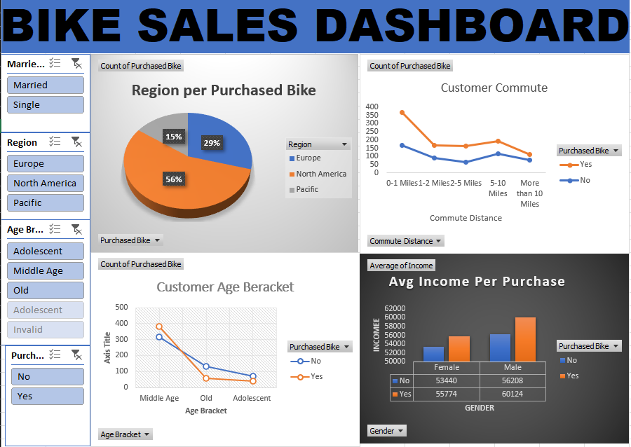

Data Analytics Portfolio

Welcome to my data analytics portfolio. This repository contains projects demonstrating my skills in SQL and Microsoft Excel, including data cleaning, analysis, visualization, and dashboard development.

 Projects

1. SQL Projects

My SQL projects demonstrate data cleaning, transformation, querying, and analysis using SQL.

Projects include:**

- COVID-19 data analysis
- Data cleaning and standardization
- SQL querying and data exploration

[View SQL Project Files](./)

2. Bike Buyers Analysis – Advanced Excel

An advanced Excel project involving data cleaning, pivot table analysis, and dashboard development.

Skills demonstrated:**

- Data cleaning
- Excel formulas
- Pivot tables
- Data analysis
- Data visualization
- Dashboard development

Dashboard Preview:

[View Excel Bike Buyers Project](Excel_Bike_Buyers/)
