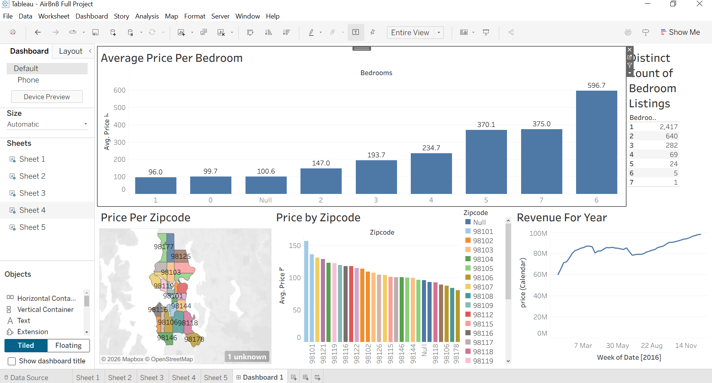
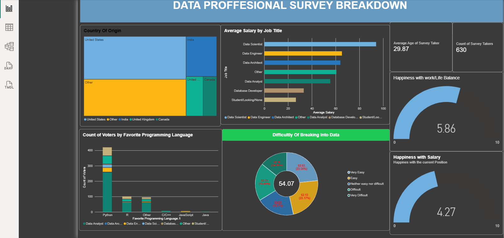

# Samson Omar — Data Analytics Portfolio

**Data Analyst | SQL Server | Power BI | Tableau | Excel | Python**

A practical portfolio demonstrating how I turn raw and messy datasets into **clean analysis, decision-ready metrics, and clear dashboards**.

The projects cover SQL data cleaning and analysis, Excel reporting, Tableau visualization, Power BI modeling/DAX, and a Python/Streamlit interactive dashboard.

## 🚀 Live Dashboard

**[Open the Seattle Airbnb Market Dashboard →](https://seattle-airbnb-market-dashboard.streamlit.app/)**  
[Streamlit deployment platform →](https://share.streamlit.io/?utm_source)

The live dashboard is the interactive web version of the Airbnb analysis. The application uses the same public Kaggle dataset documented in the Airbnb project README.

## 👋 What I Bring

- **SQL Server:** joins, CTEs, window functions, aggregations, data cleaning and transformation
- **Power BI:** Power Query, data modeling, DAX, KPIs and interactive reporting
- **Tableau:** calculated measures, geographic analysis, time-series analysis and dashboard design
- **Excel:** formulas, pivot tables, data preparation and dashboard development
- **Python:** pandas, Plotly and Streamlit for interactive analytical applications

## ⭐ Featured Projects

| Project | Business focus | Stack |
|---|---|---|
| [Data Professional Survey — Power BI](PowerBI_Projects/PowerBI-Project/README.md) | Workforce composition, compensation, preferences and satisfaction | Power BI · Power Query · DAX · Excel |
| [Airbnb Market Analysis — Tableau](Tableau_Projects/Airbnb-Analysis/README.md) | Pricing, property characteristics, geography and availability | Tableau · Streamlit · Kaggle |
| [COVID-19 Data Analysis](SQL_Projects/COVID-19/README.md) | Cases, deaths, infection rates and vaccination progress | SQL Server |
| [National Housing Data Cleaning](SQL_Projects/Nashville_Housing/README.md) | Data quality, standardization, missing values and duplicates | SQL Server · Excel |
| [Bike Buyers Analysis](Excel_Bike_Buyers/README.md) | Customer characteristics, purchasing behavior and dashboard reporting | Excel |

## 📊 Dashboard Previews

### Bike Buyers — Excel


### Airbnb — Tableau


### Data Professional Survey — Power BI


## 🧭 How to Review This Portfolio

For the fastest overview:

1. Start with the **[live Airbnb dashboard](https://seattle-airbnb-market-dashboard.streamlit.app/)**.
2. Open a project README to see the **business problem, analytical questions, methodology, findings, and limitations**.
3. Inspect the SQL, Excel, Tableau, or Power BI files for implementation evidence.
4. Use the reproducibility notes to recreate the work where supported.

## 🧰 Skills & Evidence

| Skill | Evidence in this repository |
|---|---|
| SQL Server | COVID-19 and National Housing projects |
| Advanced SQL | CTEs, joins, window functions, temporary tables and calculated metrics |
| Data cleaning | National Housing, COVID-19 and Excel projects |
| Excel | Bike Buyers and source-data preparation |
| Tableau | Airbnb dashboard and `.twb` workbook |
| Power BI | Data Professional Survey dashboard and `.pbix` report |
| DAX | Power BI measures and KPIs |
| Power Query | Power BI data preparation workflow |
| Python | Streamlit dashboard in `app.py` |
| Data visualization | Excel, Tableau, Power BI and Plotly |

## 📁 Repository Structure

```text
Portfolio-Projects/
├── SQL_Projects/
│   ├── COVID-19/
│   ├── COVID-19_Data_Analysis.sql
│   ├── Nashville_Housing/
│   └── Nashville_Housing_Data_Cleaning.sql
├── Excel_Bike_Buyers/
│   ├── README.md
│   ├── Advanced_Excel_Bike_Sales_Analysis.Xlsx
│   └── dashboard.png
├── Tableau_Projects/
│   └── Airbnb-Analysis/
│       ├── README.md
│       ├── AirBnB Full Project.twb
│       └── Tableu_AirBnB_Dashboard.PNG
├── PowerBI_Projects/
│   └── PowerBI-Project/
│       ├── README.md
│       ├── Data_Professional_Survey_Analysis.pbix
│       ├── Power BI - Final Project.xlsx
│       └── POWER_BI_DASHBOARD.PNG
├── app.py
└── requirements.txt
```

## 📚 Data Sources & Attribution

### COVID-19
The COVID-19 project uses WHO COVID-19 data prepared for SQL Server analysis. The portfolio does not claim WHO endorsement, affiliation, or sponsorship.

- [WHO Data](https://data.who.int/)
- [WHO dataset terms and conditions](https://data.who.int/about/data/terms-and-conditions)
- [WHO COVID-19 data](https://data.who.int/dashboards/covid19/data)

### National Housing
The housing workbook is a third-party source dataset. The original provider/license for the retained copy has not been established from the repository records. The portfolio does not claim ownership of the underlying data; users redistributing the workbook should verify the original provider and applicable terms.

### Bike Buyers
The original provider/license for the retained `bike_buyers` copy is not recorded in the repository metadata. The portfolio does not claim ownership of the underlying dataset.

### Airbnb
The Airbnb analysis uses the public Kaggle dataset **alexanderfreberg/airbnb-listings-2016-dataset**. The portfolio does not claim ownership of the underlying third-party data. Verify the current Kaggle license and attribution requirements before redistribution.

### Power BI
The Power BI project uses the **Data Professional Survey** dataset associated with Alex The Analyst. The included Excel workbook is the source file used by the report. The portfolio does not claim ownership of the original survey responses.

## 🔄 Reproducibility Notes

- **SQL:** Open the `.sql` files in SQL Server Management Studio or another SQL Server-compatible environment. The project READMEs identify the accompanying datasets.
- **Excel:** Download the workbook and open it in Microsoft Excel or a compatible spreadsheet application.
- **Tableau:** Open the `.twb` file in Tableau Desktop. The workbook may require the source Excel connection to be repointed on another computer.
- **Power BI:** Open the `.pbix` file in Power BI Desktop. If prompted, update the source path to the included Excel workbook before refreshing.
- **Streamlit:** Install `requirements.txt` and run `streamlit run app.py`. The application uses the same public Airbnb Kaggle dataset referenced by the Tableau project.

## ⚠️ Important Limitations

- Dashboard observations are descriptive and should not automatically be interpreted as causal relationships.
- Third-party datasets may have licensing, provenance, coverage, and data-quality limitations.
- GitHub does not render `.twb` or `.pbix` files as interactive dashboards; static previews are provided for browser-based review.
- The Tableau workbook may require its local source connection to be repointed when opened on another machine.

## 👤 About

**Samson Omar** — Data analytics portfolio focused on practical SQL, Excel, Tableau, Power BI, Python, data preparation, exploratory analysis and dashboard development.

- GitHub: [@omarsamson85-dev](https://github.com/omarsamson85-dev)

## ⭐ Reviewer's Shortcut

If you are a recruiter or hiring manager, start with the **[live Airbnb dashboard](https://seattle-airbnb-market-dashboard.streamlit.app/)**, **[Power BI project](PowerBI_Projects/PowerBI-Project/README.md)** and **[COVID-19 SQL analysis](SQL_Projects/COVID-19/README.md)**. The remaining projects provide additional evidence of data cleaning, Excel reporting and analytical workflow discipline.
